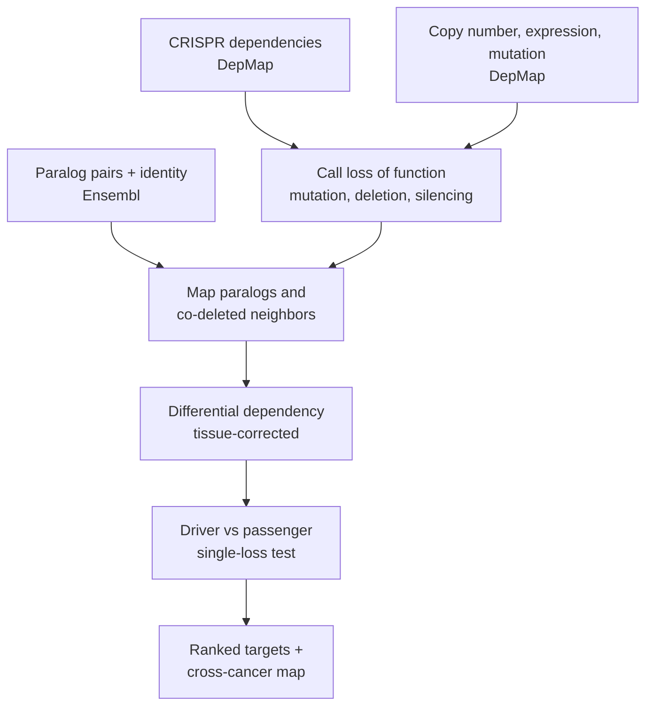

# Synthetic lethality from cancer dependency data

**Baja Bio · Bioinformatics**
Primary author: **Jeff Milton**

A toolkit for discovering and prioritizing cancer synthetic-lethal drug targets from public
genome-scale data (DepMap CRISPR dependencies, copy number, expression, mutation; Ensembl paralogs;
GTEx; protein interactions). It implements two complementary target-discovery models and the
driver-versus-passenger discipline that keeps their predictions honest.

The central idea: cancers delete DNA in blocks, so a deleted gene often drags an innocent neighbor
(a *passenger*) down with it. When that passenger has an essential **paralog**, the surviving copy
becomes a selective, druggable vulnerability. The same logic, applied to two lost genes at once,
finds **higher-order** (third-gene) targets.

---

## What is here

Two models, one principle.

1. **Paralog synthetic-lethality predictor** (`src/paralog_model/`)
   Predicts, for any paralog pair, whether one becomes essential when its partner is lost. Trained on
   DepMap-derived labels with generalizable features (sequence identity, family size, co-dependency,
   co-expression, protein interaction, normal-tissue expression). Recovers validated targets
   (VPS4A, SMARCA4, MAGOH) blind. Includes the honest finding that a DepMap-derived label is entangled
   with single-gene essentiality, and that generalizable pair features win on independent validation.

2. **Higher-order (third-gene) model** (`src/higher_order/`)
   Screens two-gene-loss backgrounds for a third gene that becomes selectively essential, corrected for
   tissue of origin, and classifies each hit as a genuine three-way interaction or a passenger-driven
   one. Produces a ranked target catalogue and per-cancer-type applications.

3. **Two-gene-background target ranker** (`src/predict/rank_targets.py`)
   Give it two genes lost in a cancer (the "background") and, optionally, a tissue; it returns a
   rank-ordered list of third-gene targets that become selectively essential when both are lost. Loss is
   read from a mutation/deletion/silencing table (so a mutation-lost gene like TP53 is handled
   correctly), the score is tissue-corrected, and each hit is labelled genuine higher-order or
   passenger-driven. Recovers known biology blind: `RB1 + TP53` returns the E2F3/SKP2/CDK2 cell-cycle
   axis; `CDKN2A + MTAP` returns the PRMT5/WDR77 axis.

4. **Driver-versus-passenger analysis** (`src/dependency_screens/driver_vs_passenger.py`)
   Decomposes any two-loss dependency into its single-loss parts, separating a true interaction from a
   co-deleted passenger.

5. **Collateral lethality and dosage-sensitive targets** (`src/collateral_lethality/`)
   The ENO1/ENO2 homozygous-deletion case, its limitation for heterozygous events, and the
   expression-based search that finds dosage-sensitive targets (e.g., ATP1A1 for 1p/19q loss).

---

## Repository layout

```
src/
  data_prep/            Extract and stream DepMap matrices; call loss-of-function
  dependency_screens/   Lineage-corrected differential dependency; third-gene screen; driver/passenger
  predict/              Two-gene-background target ranker (rank_targets.py) — the reusable predictor
  paralog_model/        Build labels (v1 expression, v2 copy-number+complex+GTEx), train, validate
  higher_order/         Systematic third-gene model; pancreatic screens; cancer applications
  collateral_lethality/ ENO1/ENO2; locate 1p/19q partners; expression-based target search; ATP1A1
  applications/         Per-cancer profiles; cross-cancer paralog-target map; conservation fetch
results/
  models/               Trained model (paralog_sl_model.pkl) + ranked prediction tables
  predictions/          Two-gene-background target rankings (breast, pancreatic) from rank_targets.py
  tables/               Per-screen output tables (CSV)
  figures/              All figures (PNG)
docs/
  DATA_SOURCES.md       Every external dataset, with download URLs / figshare IDs
  chapters/             Long-form write-ups of each result (Markdown)
```

## Models and outputs (`results/`)

| File | What it is |
|---|---|
| `models/paralog_sl_model.pkl` | Trained paralog-SL classifier (gradient-boosted trees) + feature list |
| `models/paralog_SL_predictions.csv` | Every human paralog pair, scored |
| `models/third_gene_targets.csv` | Ranked third-gene targets by two-loss background, with driver/passenger call |
| `tables/pancreatic_paralog_targets.csv` | Pancreatic passenger-paralog target portfolio |
| `tables/oligo_1p19q_expression_targets.csv` | Dosage-sensitive targets for 1p/19q loss |
| `tables/sl_{PTEN,SMARCA4,ARID1A}_v2.csv` | Lineage-corrected dependency screens |
| `predictions/breast_RB1_TP53_targets.csv` | Breast: `RB1 + TP53` background, ranked targets (E2F3, SKP2, CDK2) |
| `predictions/breast_PTEN_TP53_targets.csv` | Breast: `PTEN + TP53` background, ranked targets |
| `predictions/pancreas_SMAD4_TP53_targets.csv` | Pancreatic: `SMAD4 + TP53` background, ranked targets |
| `predictions/pancreas_CDKN2A_{TP53,MTAP}_targets.csv` | Pancreatic: `CDKN2A` backgrounds (MTAP recovers PRMT5/WDR77) |
| `predictions/pancreas_KRAS_TP53_targets.csv` | Pancreatic: `KRAS + TP53` background, ranked targets |

## Pipeline



## Install

```bash
python -m venv venv && source venv/bin/activate
pip install -r requirements.txt
```

## Getting the data

The scripts operate on public datasets that are **not redistributed here** (DepMap has its own terms of
use). See [`docs/DATA_SOURCES.md`](docs/DATA_SOURCES.md) for every source with exact download URLs and
figshare file IDs. Place the downloaded files in a working directory and adjust the input paths at the
top of each script (they currently point to local filenames such as `gene_effect_full.csv`).

## Predicting targets for your own two-gene background

The `rank_targets` predictor is the "add two genes, get a ranked target list" tool. Point it at the
DepMap dependency, expression, and lineage files (see `docs/DATA_SOURCES.md`) plus the loss-of-function
table built by `src/data_prep/call_loss_of_function.py`:

```bash
bin/a_view_to_a_kill SMAD4 TP53 \
    --tissue Pancreas \
    --gene-effect gene_effect_full.csv \
    --expression uni_expr.csv \
    --model Model.csv \
    --loss-matrix lof_matrix.csv \
    --out my_targets.csv
```

(`bin/a_view_to_a_kill` is a thin launcher for `src/predict/rank_targets.py`; put `bin/` on your PATH
to call `a_view_to_a_kill` from anywhere.)

Or from Python:

```python
from rank_targets import load_data, rank_targets
data = load_data("gene_effect_full.csv", "uni_expr.csv", "Model.csv",
                 loss_matrix_csv="lof_matrix.csv")
df = rank_targets("RB1", "TP53", tissue="Breast", **data)   # -> E2F3, SKP2, CKS1B, CDK2 ...
```

Each row is a candidate target with a lineage-corrected selectivity score (`t`), an FDR, the effect in
the double-loss lines (`eff_double`), the single-loss effects (`eff_A_only`, `eff_B_only`), a `synergy`
term (double worse than either single), the effect within your chosen tissue, and an `interpretation`
of *genuine higher-order* versus *driven by* one gene. Note that `--loss-matrix` currently covers the 16
tumor-suppressor backgrounds in `lof_matrix.csv`; extend that table to add more background genes.

## Running

A typical flow:

1. `src/data_prep/` — download and subset the DepMap matrices; call loss of function.
2. `src/dependency_screens/third_gene_screen.py` — screen a two-gene-loss background.
3. `src/dependency_screens/driver_vs_passenger.py` — decompose hits into driver vs passenger.
4. `src/higher_order/systematic_third_gene_model.py` — the full third-gene target catalogue.
5. `src/paralog_model/01..05` — build labels, train, validate the paralog predictor.
6. `src/applications/cross_cancer_paralog_targets.py` — the cross-cancer target map.
7. `src/collateral_lethality/` — the oligodendroglioma / dosage-sensitive analyses.

## Honest caveats

This toolkit generates **hypotheses**, not validated targets.

- Dependencies come from **cell lines**, not patient tumors, in 2D culture.
- "Loss" is often approximated from **expression or copy number**, a proxy for the true genetic event.
- A predictive label built from single-gene dependency is **entangled with essentiality**; independent
  labels (combinatorial double-knockout screens) are the correct upgrade. See
  `docs/chapters/chapter-06-paralog-model.md`.
- Higher-order "genuine three-way" calls are a **first-pass** classification; most two-loss dependencies
  are single-driver plus a co-deleted passenger.
- On-target toxicity matters: a nominated target still needs a modality and a therapeutic window
  (see the ATP1A1 / antisense-oligonucleotide discussion in the collateral-lethality write-up).

## Authors

Developed at **Baja Bio · Bioinformatics**.

- **Primary author:** Jeff Milton
- Analysis, curation, and methodology provided by Baja Bio.
- Built on public dependency and genomic resources (DepMap, Ensembl, GTEx, BioPlex, SynLethDB); see
  [`docs/DATA_SOURCES.md`](docs/DATA_SOURCES.md).

For questions or collaboration, contact Baja Bio · Bioinformatics.

## Citation

If you use this toolkit, please cite:

> Milton, J. *Synthetic lethality from cancer dependency data: paralog and higher-order target
> discovery.* Baja Bio · Bioinformatics (2026).

## License

MIT. See [`LICENSE`](LICENSE). External datasets retain their own licenses and terms of use.
